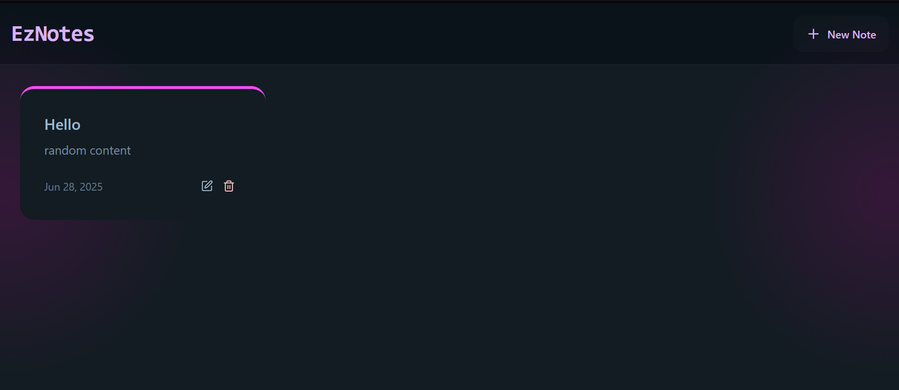

# 📝 EzNotes - The notes app you're looking for

Video Demo: https://drive.google.com/file/d/1OgfyyYt5byX3QFDNvQRhtq0mLAcX6c-x/view?usp=sharing

### EzNotes is a minimalist, full-stack Notes App using modern web technologies and best practices.  
### Create. Edit. Organize. All in one clean interface.


---

## 📸 Preview

<p align="center">
  
</p>

---

## 🧰 Tech & Tools Used

| Category     | Stack / Library                     |
|--------------|--------------------------------------|
| 💻 Frontend  | React, Vite, **TailwindCSS**, **DaisyUI**, **React Router** |
| ⚙️ Backend   | Node.js, Express.js, **Mongoose** (ODM for MongoDB) |
| 🧠 Database  | MongoDB                              |
| 🧾 Versioning| **Git** for source control           |
| 🧱 UI Design | Utility-first with **TailwindCSS**, prebuilt components via **DaisyUI** |
| 🚦 Routing   | **React Router DOM** for SPA routing |
| 🌐 API       | RESTful services via Express         |

---

## ✨ Core Features

- ✅ **CRUD** Notes (Create, Read, Update, Delete)
- 📁 Responsive layout for mobile & desktop
- 🔁 Client-side routing with **React Router**
- ⚡ Fast frontend bundling with **Vite**
- 🎨 Utility-first CSS with **TailwindCSS**
- 🧩 Reusable components from **DaisyUI**
- 📦 API integration with **Express**
- 🔐 Secure data with **Mongoose** + **MongoDB**
- 🔄 Realtime-like UI updates with React state
- 🧪 Ready-to-deploy structure (Vercel, Render)

---

## 🛠️ Installation Guide

### 1. Clone Repository

```bash
git clone https://github.com/yourusername/EzNotes.git
cd EzNotes
````

### 2. Install Dependencies

**Backend:**

```bash
cd backend
npm install
```

**Frontend:**

```bash
cd ../frontend
npm install
```

### 3. Setup Environment

Create `.env` inside `/backend` with your DB info:

```env
MONGO_URI=your_mongodb_uri
PORT=5001
UPSTASH_REDIS_REST_URL=your_rest_url
UPSTASH_REDIS_REST_TOKEN=your_rest_token
NODE_ENV=production
```

### 4. Run Servers

```bash
npm run build

npm run start
```

---

## 🧠 Folder Structure

```
EzNotes/
├── backend/
│   ├── models/       # Mongoose schemas
│   ├── routes/       # API endpoints
│   └── server.js     # Entry point
├── frontend/
│   ├── src/
│   │   ├── components/  # UI Elements
│   │   ├── pages/       # Routes & Views
│   │   └── App.jsx      # Main wrapper with Router
├── .env
├── README.md
└── package.json
```

---

## 🎨 UI Example Code

```jsx
// A simple button using DaisyUI
<button className="btn btn-accent">
  Add Note
</button>
```

```jsx
// React Router Example
<Routes>
  <Route path="/" element={<Home />} />
  <Route path="/note/:id" element={<NoteDetail />} />
</Routes>
```

---

## 🔌 REST API Routes

| Method | Endpoint         | Description       |
| ------ | ---------------- | ----------------- |
| GET    | `/api/notes`     | Fetch all notes   |
| GET    | `/api/notes/:id` | Get single note   |
| POST   | `/api/notes`     | Create a new note |
| PUT    | `/api/notes/:id` | Update a note     |
| DELETE | `/api/notes/:id` | Delete a note     |

---

## 💡 Inspiration & Fonts

* UI inspired by modern tools like Notion & Bear
* Uses [Inter Font](https://rsms.me/inter/) for clean, legible text

```html
<link href="https://fonts.googleapis.com/css2?family=Inter:wght@400;600;700&display=swap" rel="stylesheet">
```

Use it in your Tailwind config:

```js
theme: {
  fontFamily: {
    sans: ['Inter', 'sans-serif'],
  }
}
```

---

## 📄 License

MIT License © 2025 [Ezre](https://github.com/ezrelafidelynn)

---

## 📬 Feedback & Contribution

Have a feature idea or found a bug?
Feel free to open an issue or pull request!

---


